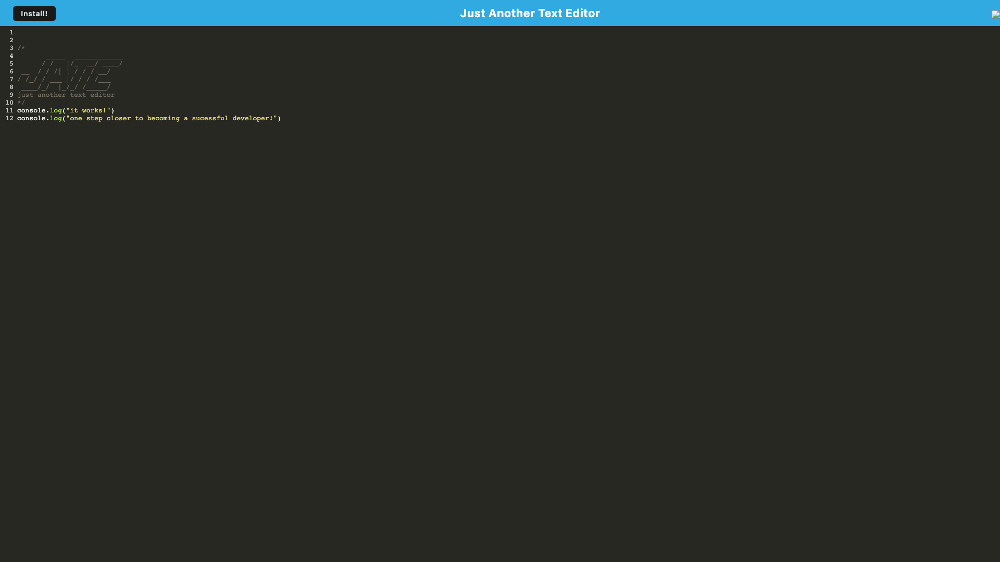

# text-editor

## Description

With social media becoming a staple in our daily lives, I used this project to showcase the API that goes into it. I built this mock API for a social network to showcase GET/POST/PUT/Delete routes being used to send, store, & delete data. MongoDB was used as the server to store the data while node.js was used to run the packages necessary to running the application. Test the applications functionality by running the installation commands

## Installation

-   npm i
-   npm run seed
-   nodemon

## Technologies Used

-   Javascript
-   MongoDB
-   Node.js
-   Express.js
-   Mongoose

## Screenshot

## Links to Application

-   Here is the repo: [Jon's Social Network API Repo](https://github.com/Jonchirinos/text-editor)
-   Here is a link to Heroku: [Jon's Social Network API DEMO](https://text-editor-jc01.herokuapp.com/)
